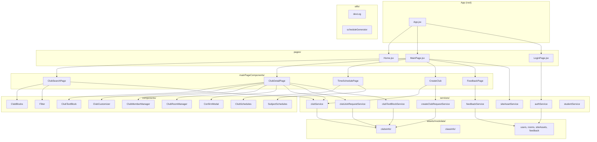
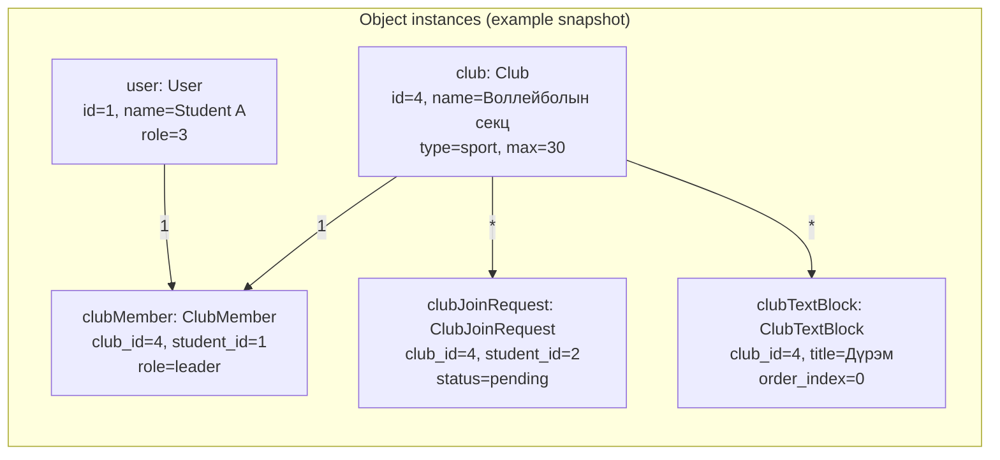
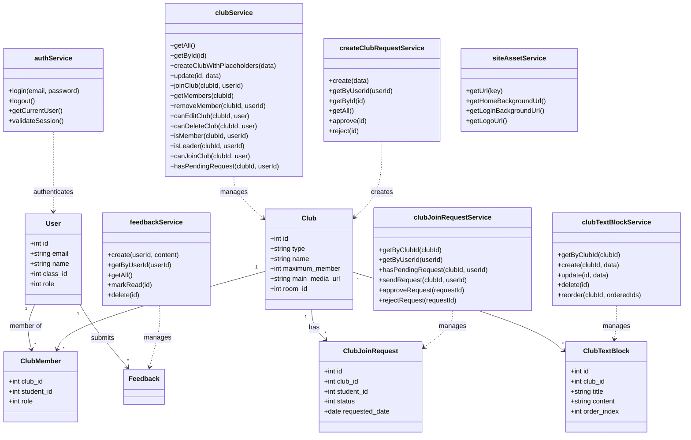
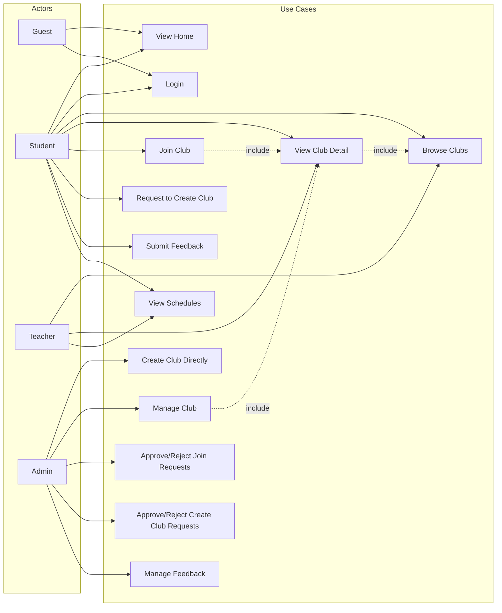
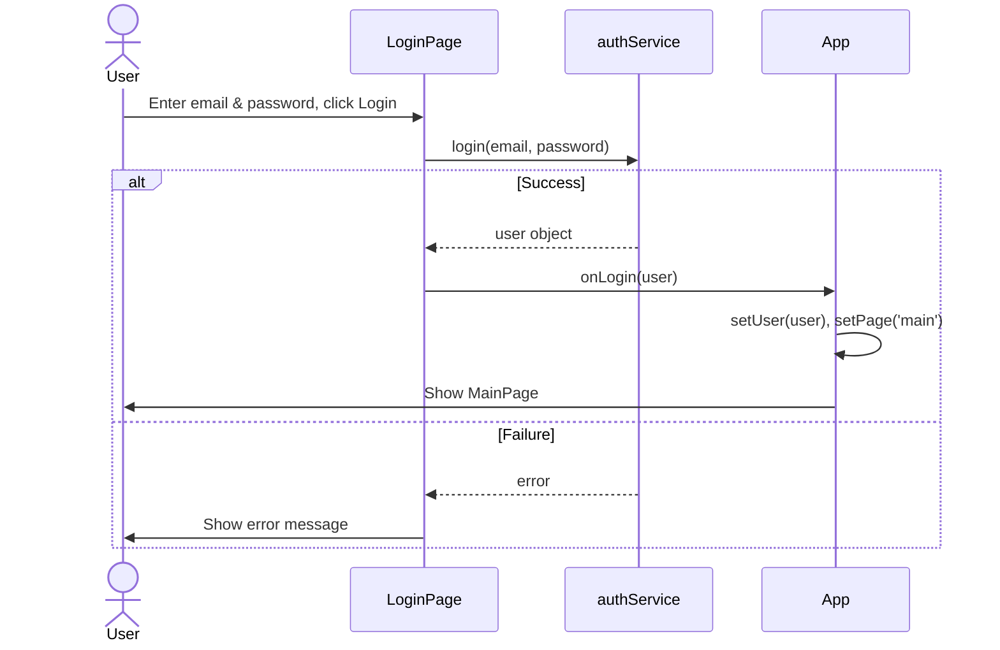
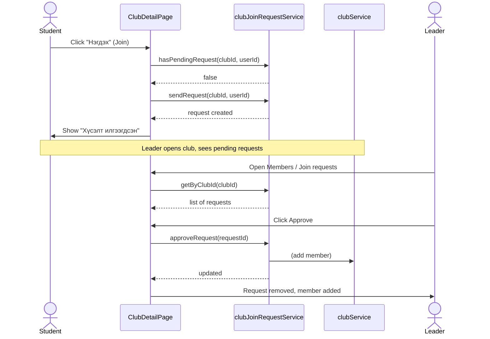
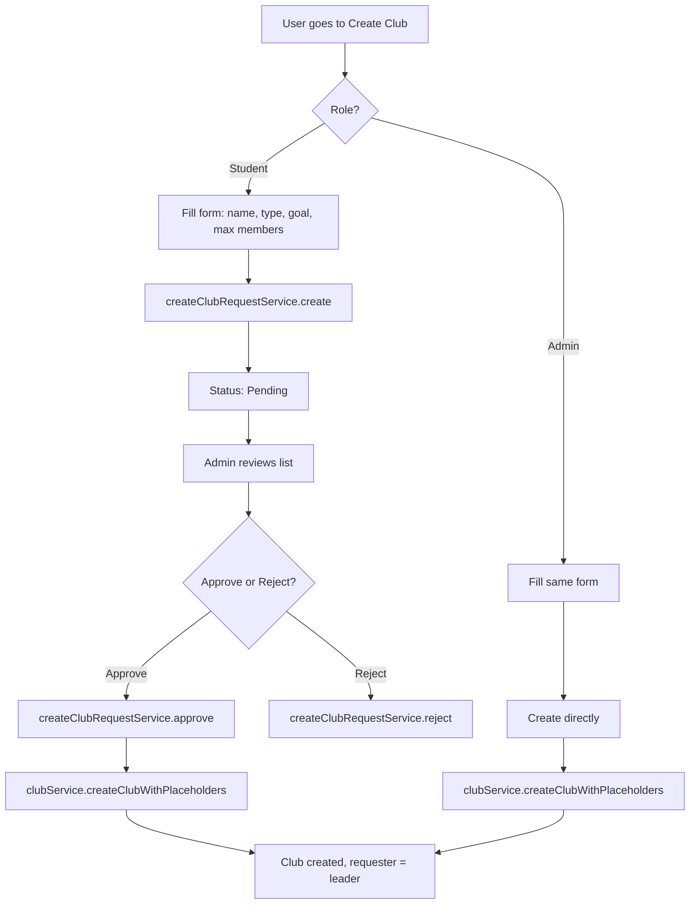
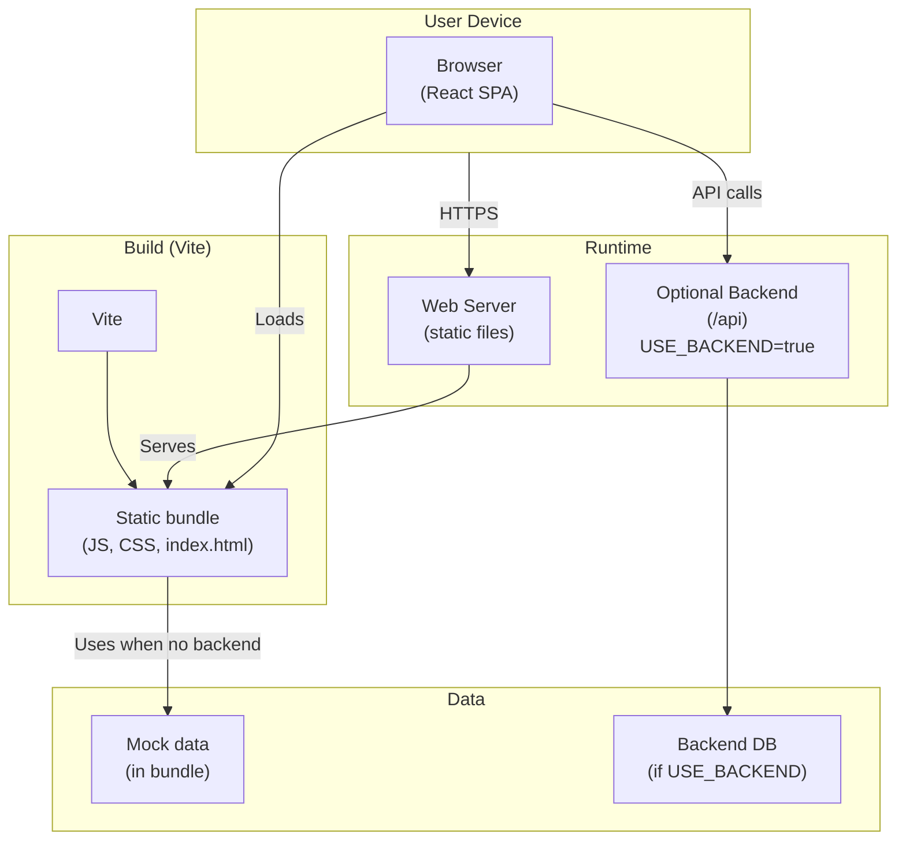

# Koosen Club Web – System Diagrams

All diagrams use [Mermaid](https://mermaid.js.org/) syntax. Render in VS Code (Mermaid extension), GitHub, or [mermaid.live](https://mermaid.live).

---

## 1. Structural Diagram (Package / Module Structure)

Shows the high-level organization of the application into packages and modules.



---

## 2. Object Diagram (Snapshot at Runtime)

Shows a typical runtime snapshot: one user, one club, and related objects.



---

## 3. ER Diagram (Entity–Relationship)

Entities and relationships for the data layer (mock/DB).

```mermaid
erDiagram
    User ||--o{ ClubMember : "has"
    User ||--o{ ClubJoinRequest : "requests"
    User ||--o{ CreateClubRequest : "creates"
    User ||--o{ Feedback : "submits"

    Club ||--|{ ClubMember : "has"
    Club ||--o{ ClubJoinRequest : "receives"
    Club ||--|{ ClubTextBlock : "has"
    Club ||--o{ ClubScheduleDay : "has"
    Club ||--o{ ClubScheduleTime : "has"
    Club ||--|{ ClubAllowedCollegeYears : "has"
    Club ||--|{ ClubAllowedEngineerClasses : "has"
    Club }o--|| Room : "uses"

    User {
        int id PK
        string email
        string password
        string name
        int class_id FK
        int role
    }

    Club {
        int id PK
        string type
        string name
        int maximum_member
        string main_media_url
        int room_id FK
    }

    ClubMember {
        int club_id PK,FK
        int student_id PK,FK
        int role
    }

    ClubJoinRequest {
        int id PK
        int club_id FK
        int student_id FK
        int status
        date requested_date
        int reviewed_by FK
    }

    CreateClubRequest {
        int id PK
        int requester_id FK
        string name
        string type
        string goal
        int maximum_member
        int status
        date requested_date
        int reviewed_by FK
    }

    ClubTextBlock {
        int id PK
        int club_id FK
        string title
        string content
        string media_url
        string media_type
        int order_index
    }

    ClubScheduleDay {
        int club_id PK,FK
        int day_of_week
    }

    ClubScheduleTime {
        int club_id PK,FK
        string start_time
        string end_time
    }

    ClubAllowedCollegeYears {
        int club_id FK
        int college_year
    }

    ClubAllowedEngineerClasses {
        int club_id FK
        string engineer_class
    }

    Room {
        int id PK
        boolean allowed_for_club
    }

    Feedback {
        int id PK
        int user_id FK
        string content
        date requested_date
        int status
    }

    Class {
        string id PK
        int teacher_id FK
        int room_id FK
    }

    Subject {
        int id PK
        string subject_name
        int teacher_id FK
        int room_id FK
    }

    SubjectSchedule {
        int id PK
        int subject_id FK
        string class_id FK
        boolean fixed
        int day_of_week
        int start_period
    }
```

---

## 4. Class Diagram (Domain & Services)

Domain entities and service facades with main operations.



---

## 5. Component Diagram (Software Components & Dependencies)

High-level components and their dependencies.

```mermaid
flowchart TB
    subgraph Client["Client (Browser)"]
        App[App]

        subgraph Pages["Pages"]
            Home[Home]
            MainPage[MainPage]
            LoginPage[LoginPage]
        end

        subgraph Screens["Main Screens"]
            ClubSearchPage[ClubSearchPage]
            ClubDetailPage[ClubDetailPage]
            TimeSchedulePage[TimeSchedulePage]
            CreateClub[CreateClub]
            FeedbackPage[FeedbackPage]
        end

        subgraph UI["UI Components"]
            ClubBlocks[ClubBlocks]
            ClubTextBlock[ClubTextBlock]
            ClubCustomizer[ClubCustomizer]
            ClubMemberManager[ClubMemberManager]
            ClubRoomManager[ClubRoomManager]
            Filter[Filter]
            ConfirmModal[ConfirmModal]
            ClubSchedules[ClubSchedules]
            SubjectSchedules[SubjectSchedules]
        end
    end

    subgraph Services["Service Layer"]
        authService[authService]
        clubService[clubService]
        clubJoinRequestService[clubJoinRequestService]
        clubTextBlockService[clubTextBlockService]
        createClubRequestService[createClubRequestService]
        feedbackService[feedbackService]
        siteAssetService[siteAssetService]
        studentService[studentService]
    end

    subgraph Data["Data (Mock / API)"]
        MockData[(Mock Data)]
        API["/api (optional)"]
    end

    App --> Home
    App --> MainPage
    App --> LoginPage
    MainPage --> ClubSearchPage
    MainPage --> ClubDetailPage
    MainPage --> TimeSchedulePage
    MainPage --> CreateClub
    MainPage --> FeedbackPage

    ClubSearchPage --> ClubBlocks
    ClubSearchPage --> Filter
    ClubDetailPage --> ClubTextBlock
    ClubDetailPage --> ClubCustomizer
    ClubDetailPage --> ClubMemberManager
    ClubDetailPage --> ClubRoomManager
    ClubDetailPage --> ConfirmModal
    TimeSchedulePage --> ClubSchedules
    TimeSchedulePage --> SubjectSchedules

    LoginPage --> authService
    ClubSearchPage --> clubService
    ClubDetailPage --> clubService
    ClubDetailPage --> clubJoinRequestService
    ClubDetailPage --> clubTextBlockService
    CreateClub --> clubService
    CreateClub --> createClubRequestService
    FeedbackPage --> feedbackService
    MainPage --> siteAssetService

    authService --> MockData
    authService --> API
    clubService --> MockData
    clubService --> API
    clubJoinRequestService --> MockData
    clubTextBlockService --> MockData
    createClubRequestService --> MockData
    feedbackService --> MockData
    siteAssetService --> MockData
```



---

## 6. Use Case Diagram

Actors and use cases for Koosen Club Web.



---

## 7. Sequence Diagram – Login

Interaction between user, LoginPage, authService, and App.



---

## 8. Sequence Diagram – Join Club

User requests to join a club; leader can approve/reject.



---

## 9. Activity Diagram – Club Join Flow

Decisions and steps for joining a club.

```mermaid
flowchart TD
    A[User opens Club Detail] --> B{Logged in?}
    B -->|No| C[Show Login prompt / redirect]
    B -->|Yes| D{Already member?}
    D -->|Yes| E[Show "Та аль хэдийн гишүүн"]
    D -->|No| F{Pending request?}
    F -->|Yes| G[Show "Хүсэлт илгээгдсэн"]
    F -->|No| H{Can join?<br/>year/class allowed}
    H -->|No| I[Show "Элссэн боломжгүй"]
    H -->|Yes| J[User clicks Join]
    J --> K[clubJoinRequestService.sendRequest]
    K --> L[Show success message]
```

---

## 10. Activity Diagram – Create Club (Student vs Admin)

Student submits request; admin approves or creates directly.



---

## 11. Deployment Diagram

How the application is deployed (browser, Vite build, optional backend).



---

## Summary

| Diagram            | Section | Description                                              |
|--------------------|---------|----------------------------------------------------------|
| Structural         | 1       | Package/module structure (pages, components, services).  |
| Object             | 2       | Example runtime snapshot (user, club, members, requests).|
| ER                 | 3       | Entities and relationships for data layer.               |
| Class              | 4       | Domain classes and service facades with methods.         |
| Component          | 5       | Software components and dependencies.                    |
| Use case           | 6       | Actors and use cases.                                    |
| Sequence (Login)   | 7       | Login flow.                                               |
| Sequence (Join)   | 8       | Join club and approve request flow.                      |
| Activity (Join)   | 9       | Club join decisions and steps.                           |
| Activity (Create) | 10      | Create club (student request vs admin direct).           |
| Deployment         | 11      | Browser, Vite, static server, optional API.              |
